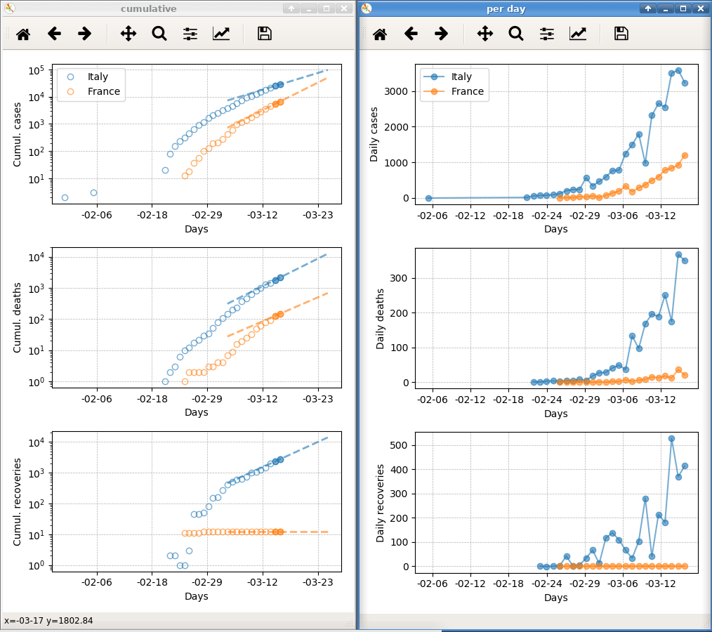
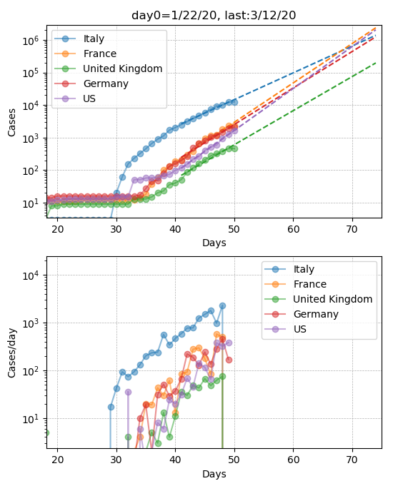
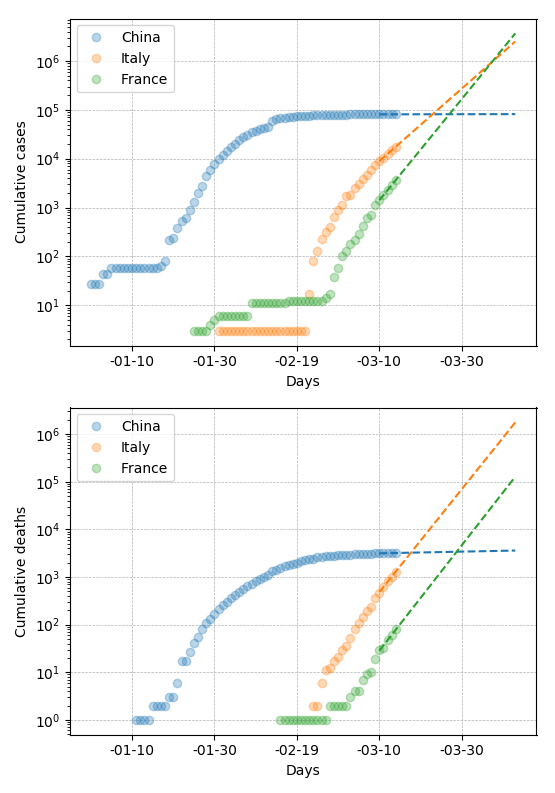

# covid19_analysis

Download, plots, and fit covid19 data from :

1) [Reccomended] wikipedia pages of each country. 
covid_analysis_wiki.py 
e.g. https://en.wikipedia.org/w/index.php?title=Template:2019%E2%80%9320_coronavirus_pandemic_data/United_Kingdom_medical_cases_chart&action=edit)

2) covid_analysis.py     : https://github.com/CSSEGISandData/COVID-19.git

3) covid_analysis_xls.py : https://www.ecdc.europa.eu/

Usage:

1) covid_analysis_wiki.Covid_analysis_wiki(download=1, countries=['Italy','France','United_States'])

2) EDIT: As for March 14th, there are still problems in this data set

First clone the data repo:

$ git clone https://github.com/CSSEGISandData/COVID-19.git

Then in python:

In [1]: import covid_analysis                                                   
In [2]: c = covid_analysis.Covid_analysis()                                     

and you should get three plots of CASES, DEATHS, RECOVERED

3) covid_analysis_xls.py:

In [1]: import covid_analysis_xls

In [2]: covid_analysis_xls.covid_analysis_xls(download=True, countries=['China','Italy','France','Spain','United Kingdom','United States of America'], fitpts=5, fitpts_ext=30)

