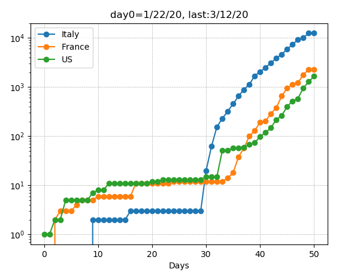

# covid19_analysis
plots covid19 data from https://github.com/CSSEGISandData/COVID-19.git

First clone the data repo:

$ git clone https://github.com/CSSEGISandData/COVID-19.git

Then in python:

In [1]: import covid_analysis                                                   
In [2]: c = covid_analysis.Covid_analysis()                                     
In [3]: c.plots_countries(['Italy', 'France', 'US'])   

