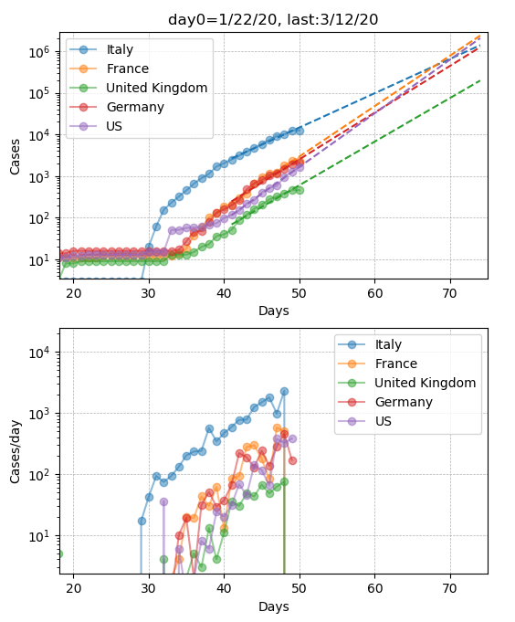
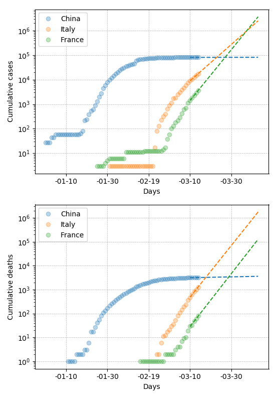

# covid19_analysis

plots and fit covid19 data from 

1) covid_analysis.py     : https://github.com/CSSEGISandData/COVID-19.git
or 
2) covid_analysis_xls.py : https://www.ecdc.europa.eu/

Usage:

1) EDIT: As for March 14th, there are still problems in this data set

First clone the data repo:

$ git clone https://github.com/CSSEGISandData/COVID-19.git

Then in python:

In [1]: import covid_analysis                                                   
In [2]: c = covid_analysis.Covid_analysis()                                     

and you should get three plots of CASES, DEATHS, RECOVERED

2) covid_analysis_xls.py:

In [1]: import covid_analysis_xls

In [2]: covid_analysis_xls.covid_analysis_xls(download=True, countries=['China','Italy','France','Spain','United Kingdom','United States of America'], fitpts=5, fitpts_ext=30)

